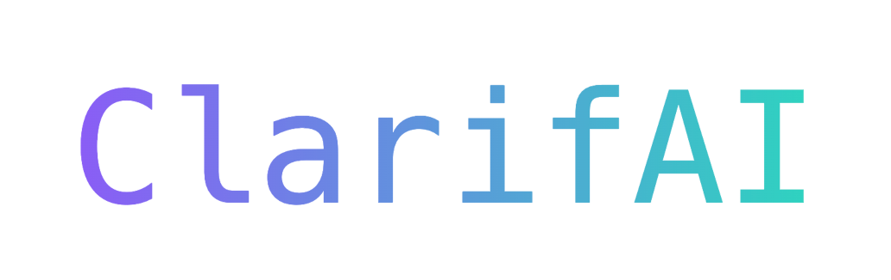

# sv

Welcome to **sv**! Everything you need to build a **Svelte** project, powered by [`sv`](https://github.com/sveltejs/cli).

---

## 🚀 Creating a Project

If you're seeing this, you’ve probably already completed this step—congrats! 🎉

To create a new Svelte project, use the following commands:

1. **Create a new project in the current directory:**
    ```bash
    npx sv create
    ```

2. **Create a new project in a specific directory (e.g., `my-app`):**
    ```bash
    npx sv create my-app
    ```

---

## 🖥️ Developing

Once you've created your project and installed the necessary dependencies, you can start developing! To install dependencies, use your preferred package manager:

- `npm install`
- `pnpm install`
- `yarn`

Then, start the development server:

```bash
npm run dev
```

### Optional: Open the app automatically in a new browser tab
```bash
npm run dev -- --open
```

---

## ⚙️ Building for Production

To create a production version of your app, simply run:

```bash
npm run build
```

### Previewing the Production Build
You can preview the production build locally by running:

```bash
npm run preview
```

---

## 📦 Deploying Your App

To deploy your app, you may need to install an [adapter](https://svelte.dev/docs/kit/adapters) that fits your target environment. For detailed deployment steps, refer to the Svelte documentation.